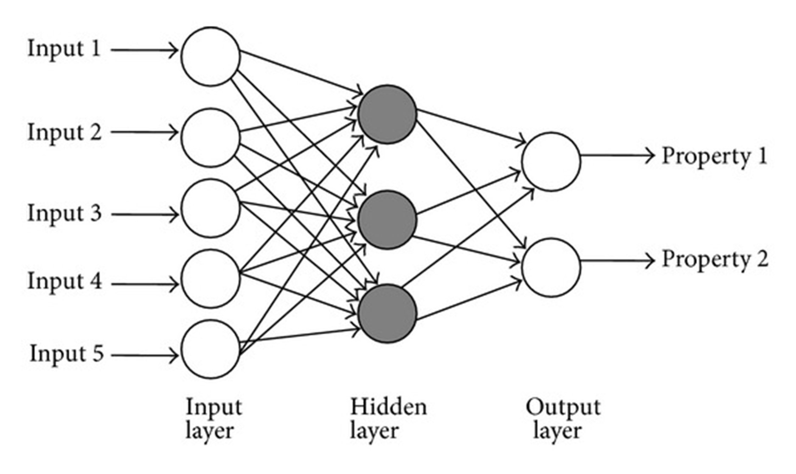

# UCI Digit Tasks - Digit Recognition

## Introduction

This is a simple Java application that uses the UCI Machine Learning Repository - [Optical Recognition of Handwritten Digits Data Set](https://archive.ics.uci.edu/dataset/80/optical+recognition+of+handwritten+digits) to train and test an `Multi-Layer Perceptron neural network`. The dataset is split into two files, `cw2DataSet1` and `cs2DataSet2`. The first file is used to train the network, and the second file is used to test the network.



A neural netowork-based classifier, called `Multi-Layer Perceptron` (MLP), is used to classify the digits. The network is consisted of an input layer, a hidden layer, and an output layer.

The number of hidden layers is hard to determine as the numbers are selected experimentally. Thereby, the following numbers are given to the first and second hidden layers which can be found in the `MultiLayerPerceptron.java` class.

```java
final static int FIRST_HIDDEN_LAYER_NODE_AMOUNT = 31;
final static int SECOND_HIDDEN_LAYER_NODE_AMOUNT = 10;
```

The network is then trained using a `backpropagation` algorithm.

A `two-fold cross-validation` is used to train and test the network from which the average accuracy is then calculated.

## Requirements

- Java 8 or later
- Java Development Kit (JDK)
- Java Runtime Environment (JRE)

## Installation

### Clone the Repository

```bash
git clone git@github.com:derecklhw/travelling_salesman.git
```

## Running the Application

### Compiling

Navigate to the `src` directory and compile the Java application:

```bash
javac digit_recognition/*.java
```

### Running

```bash
java digit_recognition.Main <dataSet1> <dataSet2>
```
